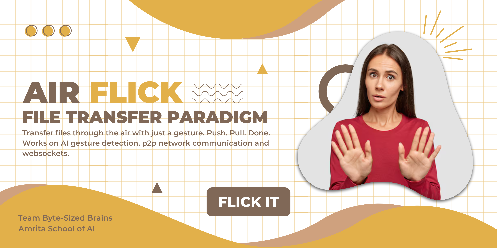

<p align="center">
  
</p>

<h1 align="center">Air Flick ✋</h1>

> A gesture-based file transfer system — no wires, no taps, just air. 
> This project was inspired by Huawei's gesture-based file transfer mechanism

---

## 🌬️ About the Project

**Air Flick** is a cutting-edge system that allows users to **transfer images between two devices** using simple hand gestures. With a swipe of your hand, files are lifted into the "air", and with another gesture, they are delivered to a nearby device — **completely touchless**.

Air Flick redefines the concept of file sharing by combining:
- **Machine Learning gesture detection**
- **Peer-to-peer communication**
- **Real-time WebSocket connections**
- **REST API-based communication**  
All within a **shared local network (subnet)**.

---

## 🛠️ How It Works

1. **Pull Gesture** 🤲  
   The user performs a **pull gesture**, recognized using **MediaPipe**, triggering the system to **select and lift** a file (image) into the air (internal buffer or shared state).

2. **Push Gesture** ✋➡️  
   The user then performs a **push gesture** toward a nearby device. The system detects the nearest peer (based on ping response time) and **drops the file** into that device.

3. **Communication**  
   - **Zeroconf** for peer discovery within subnet  
   - **WebSockets** for real-time gesture triggers  
   - **REST API** to send and receive images  

---

## 📦 Tech Stack

| Component        | Technology |
|------------------|------------|
| Gesture Detection| MediaPipe, OpenCV, Custom ML pipeline |
| Networking       | Zeroconf, WebSockets, HTTP (FastAPI) |
| Frontend         | HTML, JS (with dynamic image rendering) |
| Backend          | FastAPI (Python) |
| Communication    | Peer-to-peer within same subnet |

---

## 🚀 Getting Started

### 🔁 Clone the Repository

```bash
git clone https://github.com/macromrit/Air-Flick.git
cd Air-Flick
```

### 📦 Install Dependencies

```bash
pip install -r requirements.txt
```

---

## ▶️ Running the Application

### Step 1: Start Peer Advertisement

Open your terminal and navigate to the `p2p` folder:

```bash
cd p2p
python advertiser.py
```

This script uses Zeroconf to broadcast your device's availability to other devices on the same subnet.

---

### Step 2: Start FastAPI Backend

Open a **new terminal window**, go to the app folder, and run the FastAPI server:

```bash
cd ../app
uvicorn main:app --host 0.0.0.0 --reload
```

The backend will be available at: `http://<your-ip>:8000`

---

### Step 3: Launch the Interface

Open `webpage/index.html` in a web browser (on the same subnet as the other devices):

```bash
# For example, on most systems
open webpage/index.html      # macOS
start webpage/index.html     # Windows
xdg-open webpage/index.html  # Linux
```

This UI allows you to perform gesture-based file transfers.

---

## 🧯 Windows-Specific Fix

If **communication issues** occur on **Windows OS** (e.g., peer not detected or ping failing), follow these steps:

1. Open **Windows Defender Firewall**.
2. Click on **Advanced Settings**.
3. Go to **Inbound Rules**.
4. Find the rule:  
   **File and Printer Sharing (Echo Request - ICMPv4-In)**.
5. **Right-click** on it and **enable the rule**.

✅ This allows ping (ICMP) messages required for peer ranking via latency.

<!-- ---

## 📸 Screenshots

> _Add UI screenshots, gesture demo, or peer-to-peer success shots here_ -->

---

## 📄 License

This project is licensed under the MIT License. See the [LICENSE](./LICENSE) file for details.

---

## 🙌 Built With

- ❤️ FastAPI
- 👋 MediaPipe
- 📡 Zeroconf
- 🌐 WebSockets
- 🎯 OpenCV

---

## 🤝 Contributions Welcome

Want to improve Air Flick or add more gesture actions and file types? Feel free to fork and open a PR. Let's make file transfers cooler than ever.
